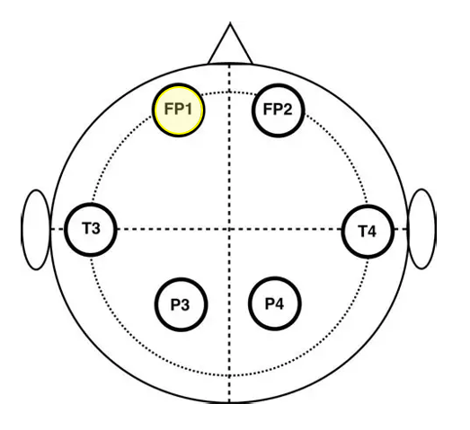

```{css, echo=FALSE}
div.logo_left{
  width: 20%;
}
div.poster_title{
  width: 80%;
}
.section h4 {
    break-after: column;
}
div.footnotes {
    font-size: 18pt;
}
```

<!-- Don't change anything above, except the title and author names, unless you know what you are doing. -->

```{r, include=FALSE}
knitr::opts_chunk$set(echo = FALSE,
                      warning = FALSE,
                      tidy = FALSE,
                      message = FALSE,
                      fig.align = 'center',
                      out.width = "100%")
options(knitr.table.format = "html") 
# Load any additional libraries here
library(tidyverse)
library(plotly)
library(kableExtra)
```

# Background 

Schizophrenia is a mental disorder that is present in \<1% of people worldwide, characterised by hallucinations, delusions and disorganised thinking.

Humans typically suppress the brain's response to expected sensory consequences when they result from their own actions, known as sensory gating. This presents as a smaller amplitude brain wave. Schizophrenia is associated with impaired sensory gating[^1].

[^1]: Boutros, N. N., Brockhaus-Dumke, A., Gjini, K., Vedeniapin, A., Elfakhani, M., Burroughs, S., & Keshavan, M. (2009). Sensory-gating deficit of the N100 mid-latency auditory evoked potential in medicated schizophrenia patients. Schizophrenia research, 113(2-3), 339–346. <https://doi.org/10.1016/j.schres.2009.05.019>

In our data, three different sensory tasks were conducted on cases and controls. The conditions are as follows:

1.  Subjects press a button to immediately produce a sound
2.  Subjects passively listen to the same sound without pressing a button
3.  Subjects press a button, and no sound is produced.

We will examine the auditory N100 brainwave (occuring ~100ms after stimulus), which indicates the early attention-triggering and allocation process, to determine whether sensory gating is occurring.

<!-- You can add references by inserting the following ^[reference details here] -->

## Objectives of Project

***Hypothesis***

We want to determine whether individuals with schizophrenia exhibit statistically different EEG signals compared to healthy controls during the task conditions.

We hypothesize that there will be a statistically significant difference between the cases and controls at the N100 around 100 ms after the sound.

We hypothesize that condition 1 will be the most different due to impaired sensory gating in schizophrenics.

We will investigate this difference using functional data analysis where FP1 will be taken as a representative frontal electrode.

***Why FP1?***

Previous EEG studies reported altered frontal activity and reduced frontal coherence in relation to schizophrenia research. [^2]

[^2]: Tauscher 1998, doi: 10.1016/S0006-3223(97)00428-9

```{r fig1, echo = FALSE, out.width="100%", fig.cap = "Nodes Cap"}



```


# Data Sources and Datasets

Our data were taken from the National Institute of Mental Health (NIMH project number R01MH058262), available from [Kaggle](www.kaggle.com/datasets/broach/button-tone-sz/data)

# Early Results 
***Raw data***

```{r fig2, echo = FALSE, out.width = '100%', fig.cap = "Raw Data Plot, Condition 1: Cases vs Controls"}

knitr::include_graphics('raw_data')

```


***Smoothing Process***

•	Spline smoothing was applied to remove noise from the data.

•	Curves represented by 100 cubic B-spline basis functions along the x-axis between 0 and 1638ms allowing enough flexibility to capture local changes in slope characteristic of brain wave data. 

•	Second-derivative penalty applied: controls the model from fitting sudden, drastic fluctuations in the data and therefore prevents the model from fitting to noise and individual level variability. 

•	This method facilitates the comparison of meaningful differences between EEG signals of controls & cases while supressing noise.

```{r fig3, echo = FALSE, out.width = '100%', fig.cap = "Mean Smoothed Curves Plot, Condition 1: Cases vs Controls"}

knitr::include_graphics('mean.fd')

```


***Permutation T-Test***

•	FDA method which tests $H_0$ that there is no difference between the two groups and therefore the group labels are arbitrary.  

•	Resampling technique which randomly assigns group labels to each group each permutation and computes a test statistic comparing the mean functions.

•	A null distribution is constructed from the permutation test statistics, and the test statistic of the observed data is then compared with this distribution.

•	If the observed difference is unlikely following the random reshuffling, there is evidence of a difference between the groups. 

•	Non-parametric: no normality or equal variance between groups assumptions.

```{r fig4, echo = FALSE, out.width = '100%', fig.cap = "Permutation T Test Plot, Condition 1: Cases vs Controls"}

knitr::include_graphics('cond1_permt')
```

```{r fig5, echo = FALSE, out.width = '100%', fig.cap = "Permutation T Test Plot, Condition 2: Cases vs Controls"}
knitr::include_graphics('cond2_permt')
```

```{r fig6, echo = FALSE, out.width = '100%', fig.cap = "Permutation T Test Plot, Condition 3: Cases vs Controls"}
knitr::include_graphics('cond3_permt')
```


#### 
# Conclusions


We conclude that we observe a significant difference between case and control, as seen in Figure (fig. \@ref(fig:fig4)). This is indicated by the observed statistic displaying a larger test statistic than the pointwise 0.05 critical value.

It is of noting that we observe a marginally significant difference at approximately T300 in Figure (fig. \@ref(fig:fig5)), and no significant result in Figure (fig. \@ref(fig:fig6)). 


This supports our above hypothesis, and gives us 


# Next Project Steps

We plan to conduct further analysis using:

-   Functional Principal Component Analysis 

We will use the `fpca` and `fda` package for this.

# GitHub

The code and datasets for this project can be viewed at our GitHub repository here: [GitHub](https://github.com/maeve-susan/MSc-Project)

# References
