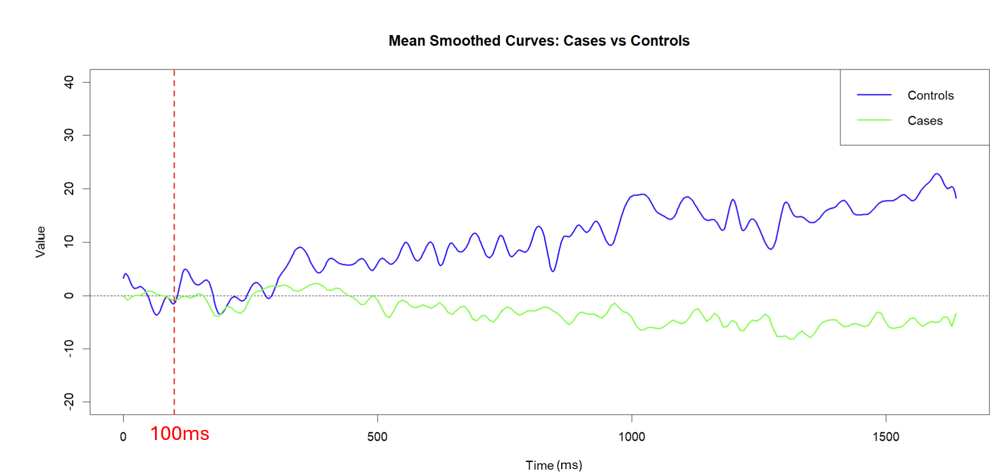
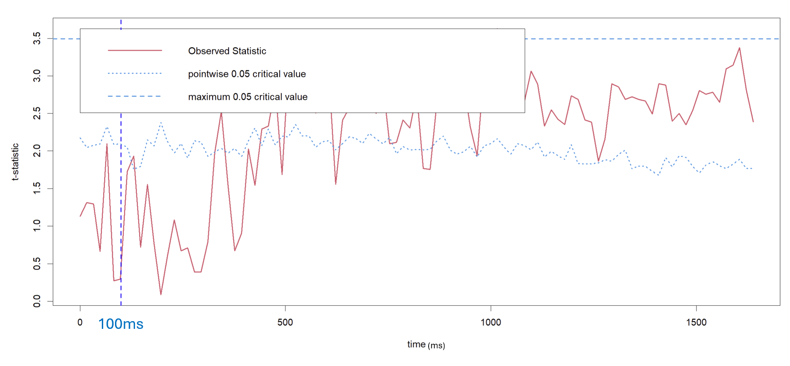
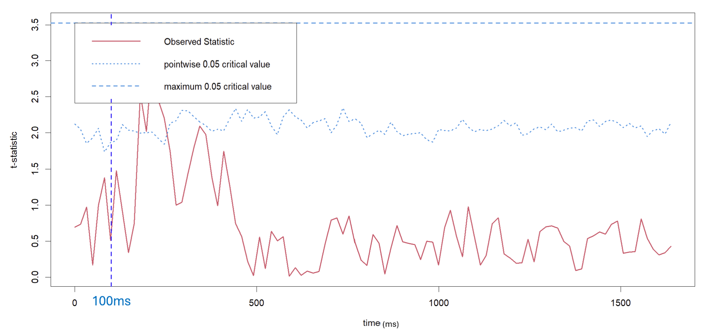
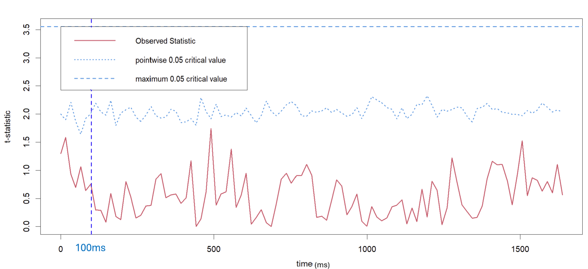

```{css, echo=FALSE}
div.logo_left{
  width: 20%;
}
div.poster_title{
  width: 80%;
}
.section h4 {
    break-after: column;
}

.section h1 {
  font-size: 40pt;
}

div.footnotes {
    font-size: 18pt;
}
```

<!-- Don't change anything above, except the title and author names, unless you know what you are doing. -->

```{r, include=FALSE}
knitr::opts_chunk$set(echo = FALSE,
                      warning = FALSE,
                      tidy = FALSE,
                      message = FALSE,
                      fig.align = 'center',
                      out.width = "100%")
options(knitr.table.format = "html") 
# Load any additional libraries here
library(tidyverse)
library(plotly)
library(kableExtra)
```

# Background

<!-- Schizophrenia is a mental disorder that is present in \<1% of people worldwide, characterised by hallucinations, delusions and disorganised thinking. -->

The brain typically suppresses its response to expected stimuli (sensory gating).

Schizophrenia is associated with impaired sensory gating[^1].

[^1]: Boutros et al., 2009, doi: <https://doi.org/10.1016/j.schres.2009.05.019>

<!-- [^1]: Boutros, N. N., Brockhaus-Dumke, A., Gjini, K., Vedeniapin, A., Elfakhani, M., Burroughs, S., & Keshavan, M. (2009). Sensory-gating deficit of the N100 mid-latency auditory evoked potential in medicated schizophrenia patients. Schizophrenia research, 113(2-3), 339–346. <https://doi.org/10.1016/j.schres.2009.05.019> -->

### Data
Our data were taken from the National Institute of Mental Health (NIMH project number R01MH058262), available from [Kaggle](www.kaggle.com/datasets/broach/button-tone-sz/data)

In our data, 36 subjects were exposed to three conditions (25 controls, 11 cases):

1.  Subjects press a button to immediately produce a sound
2.  Subjects passively listen to the same sound without pressing a button
3.  Subjects press a button, and no sound is produced.

```{r button, echo = FALSE, out.width="100%", fig.cap = "Condition Visualisation"}


```

### Objectives of Project

-   ***Hypothesis:*** Individuals with schizophrenia exhibit statistically different EEG signals compared to healthy controls during conditions ~100ms and ~200ms

- ***How?:*** Functional Data Analysis (FDA) [^3] was applied to investigate the difference in EEG signals in the FP1 node.  

- ***Why FP1?:*** Previous EEG studies reported altered frontal activity and reduced frontal coherence in relation to schizophrenia research. [^2]

[^2]: Tauscher 1998, doi: 10.1016/S0006-3223(97)00428-9

```{r fig1, echo = FALSE, out.width="60%", fig.cap = "Nodes Cap"}

knitr::include_graphics("nodes.png")

```

# Results

### Raw Data


```{r fig2, echo = FALSE, out.width = '80%', fig.cap = "Raw Data Plot, Condition 1: Cases vs Controls"}

    knitr::include_graphics('raw_data1')

```


### Smoothing Process

Spline smoothing applied to remove noise from data:

-   100 cubic B-spline functions between [0, 1638]ms  

-    Second derivative penalty applied

```{=html}
<!-- 
    
    • Spline smoothing was applied to remove noise from the data.

• Curves represented by 100 cubic B-spline basis functions along the x-axis between 0 and 1638ms allowing enough flexibility to capture local changes in slope characteristic of brain wave data.

• Second-derivative penalty applied: controls the model from fitting sudden, drastic fluctuations in the data and therefore prevents the model from fitting to noise and individual level variability.

• This method facilitates the comparison of meaningful differences between EEG signals of controls & cases while suppressing noise.
    -->
```

```{r fig3, echo = FALSE, out.width = '90%', fig.cap = "Mean Smoothed Curves Plot, Condition 1: Cases vs Controls"}



```

### Permutation T-Test

-   Testing $H_0$, no significant difference between cases and controls via FDA

-   Re-sampling technique testing and producing test statistic on each permutation

-   Comparison of the permutation null distribution and observed data following random reshuffling, the observed difference signifies evidence of a difference between the groups


```{r fig4, echo = FALSE, out.width = '100%', fig.cap = "Permutation T Test Plot, Condition 1: Cases vs Controls"}


```

-   Figure \@ref(fig:fig4) shows a significant difference between cases and controls around the 400 ms.
```{r fig5, echo = FALSE, out.width = '100%', fig.cap = "Permutation T Test Plot, Condition 2: Cases vs Controls"}

```

```{r fig6, echo = FALSE, out.width = '100%', fig.cap = "Permutation T Test Plot, Condition 3: Cases vs Controls"}

```
-   Figures \@ref(fig:fig5) and \@ref(fig:fig6) show weaker differences for Conditions 2 and 3.


# Conclusions

There is evidence to suggest our hypothesis based on the Figures produced by our t-test. This suggests that combined auditory and motor stimulation is required to trigger a significant EEG response in schizophrenia.

# Next Steps

We plan to conduct further analysis:

1.  Test for population / sensor clustering
2.  Repeated tests using other nodes e.g. FP2, FCZ
2.  Functional Principal Component Analysis
3.  Predictive modelling using features derived from FPCA scores

We will use the `fdapace` and `fda` packages [^3] for this.

[^3]: Ramsay, J. O., Hooker, G., & Graves, S. (2009). Functional data analysis with R and MATLAB. Springer.

# GitHub

The code and datasets for this project can be viewed at our GitHub repository here: [GitHub](https://github.com/maeve-susan/MSc-Project)

# References
