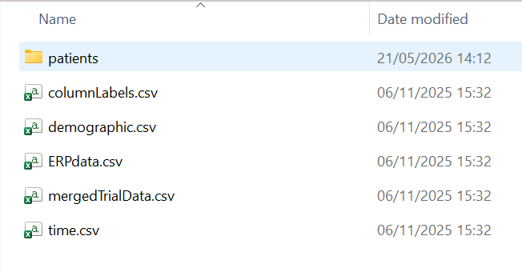
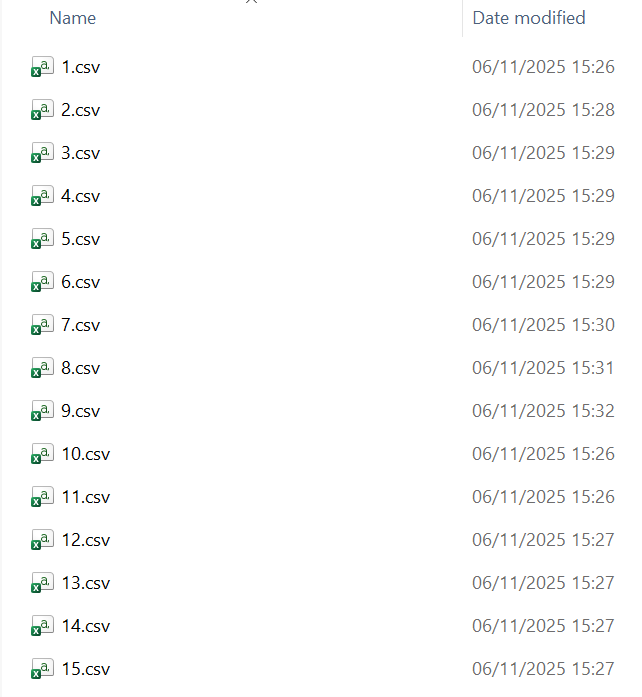

This repository for our MSc project on functional data analysis to analyse EEG signals of subjects with schizophrenia.

Instructions for data access:

The data for this project are too large to upload onto this GitHub repository. Please access this data via the kaggle link: https://www.kaggle.com/datasets/broach/button-tone-sz/data.

Once downloaded it should produce a zipped file called archive within which are several demographic and time variable files and  a patients folder. 

Within the patients folder contains an individual folder within which each subject's corresponding .csv file is located. Remove these files from their individual folders so that they are all within patients folder like this:

Our Files:

Our final code is in the Condition Split.Rmd file, the other files are previous iterations of our work which it was helpful to keep in the initial stages.
