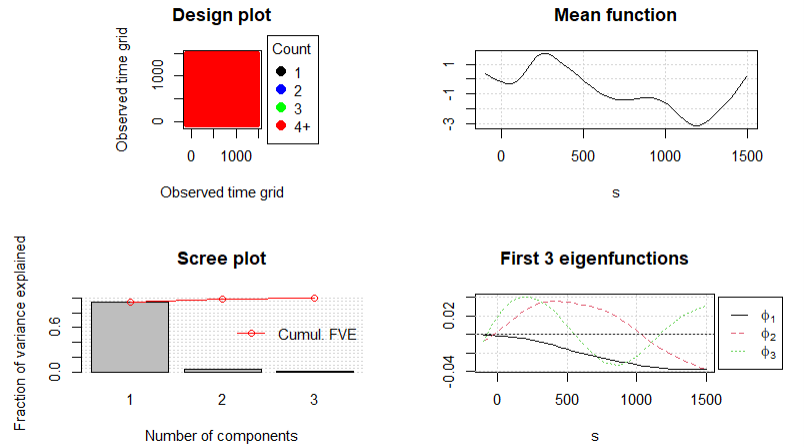
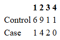

```{r, include=FALSE}
knitr::opts_chunk$set(echo = FALSE,
                      warning = FALSE,
                      tidy = FALSE, 
                      message = FALSE,
                      fig.align = 'center',
                      out.width = "100%")
options(knitr.table.format = "html") 
# Load any additional libraries here
library(tidyverse)
library(plotly)
library(kableExtra)
```

# Introduction
\label{sec:intro}

An electroencephalogram (EEG) is a non-invasive test used to measure electrical activity in the brain by attaching 64 sensor nodes to the scalp. Each sensor measures a single curve, so each test produces 64 curves. The data from EEG is commonly used to diagnose conditions such as sleep disorders, seizures and schizophrenia

Schizophrenia is a mental health condition which is associated with unusual activity in the frontal and prefrontal sections of the brain. According to Insel, T., schizophrenia presents with "paranoid delusions and auditory hallucinations late in adolescence or in early adulthood" [@Insel2010]. 

Sensory gating is the process by which the brain filters repeated, expected or redundant stimuli. This process is impaired in individuals with schizophrenia, particularly at the P50 (indicating pre-attentive filtering of sensory information), N100 and P200 (both reflecting the attention triggering/allocation process) regions of the EEG curve, which occur 50, 100 and 200 ms after an auditory stimulus, respectively. The impairment of the sensory gating process can be detected by a difference in the amplitude of these deflections in the curve [@Shen2020; @BOUTROS2009].

Functional data analysis (FDA) is a method of statistical analysis that analyses each function as an individual sample, as opposed to considering all the points along the curve separately. It is used when the underlying curve is smooth and continuous [@RamsaySilverman2005]. EEG curves are a type of functional data that indicates the brain's electrical activity by the continuous flow of voltages over time. FDA helps to effectively describe and interpret inherit changes in EEG signals and its relationship with human behaviours, making it an interpretable approach. 


- Introduce EEG, how it relates to schizophrenia, and how FDA can be used to analyse curves
- Current Literature - FDA for EEG signals or for schizophrenia has been used before? findings? etc.


## Data

Our data were taken from the National Institute of Mental Health (NIMH project number R01MH058262), available from [Kaggle](www.kaggle.com/datasets/broach/button-tone-sz/data)

In our data, 40 subjects underwent three sensory conditions (25 controls, 15 cases) in which:

1.  Subjects press a button to immediately produce a sound
2.  Subjects passively listen to the same sound without pressing a button
3.  Subjects press a button, and no sound is produced.

Each subject completed each of these sensory conditions up to 100 times. Therefore, we have many repetitions of the same conditions for each of the subjects. So in total we have approximately $64\times 40 \times 100 = 256,000$ curves.

- Explain the study background trials, conditions etc.

# Methods
\label{sec:methods}

We used several methods: spline smoothing, permutation test, FPCA & mFPCA

## Smoothing

Due to the inherently noisy nature of EEG signals, smoothing was applied to the functional observations. When smoothing functions, it is important to balance the trade-off between variance and bias. Variance refers to the sensitivity of an estimated function to random fluctuations in the observed data, while bias refers to systematic deviation of the estimated function from the true underlying signal. High variance may lead to overfitting and poor generalisability to new data, whereas high bias may over-smooth the data leading to underfitting and obscuring important signal characteristics.

Spline smoothing uses piecewise polynomial functions joined smoothly through points called knots to estimate the underlying smoothed curve and reduce noise in the data. Spline smoothing was used to reduce noise while preserving the underlying brain activity patterns. Specifically, 100 cubic B-spline basis functions were defined over the domain of each EEG signal, (0-1638ms). Using a relatively large number of basis functions provides sufficient flexibility to represent complex functional features while allowing smoothness to be controlled separately through penalisation.

A second-derivative roughness penalty was then applied. In penalised smoothing approaches, smoothness is controlled by incorporating a roughness penalty into the objective function used to fit the data, rather than by restricting the number of basis functions available [@RamsaySilverman2005]. Penalising the second derivative discourages rapid changes in curvature, allowing gradual variation in the fitted function while reducing excessive wiggliness. In practice, this encourages neighbouring B-spline coefficients to vary smoothly and can be viewed as approximating penalties on finite differences between adjacent coefficients. The roughness penalty pools information across neighbouring regions of the function, resulting in more stable estimates and reduced sensitivity to noise. Consequently, variance is reduced at the cost of a small increase in bias, yielding smoother and more interpretable functional representations of the EEG signals [@RamsaySilverman2005; @Gertheiss2024]. This can be seen in the two plots below, which compare the raw EEG curves with the corresponding smoothed curves. The raw curves exhibit substantial noise and high variability, whereas the smoothed curves provide a clearer representation of the underlying signal by reducing random variation.

Given a set of observations $\{t_i, y_i: i=1,2,...,n\}$, spline smoothing estimates a curve $X(t_i)$ from our observations assuming $y_i = X(t_i) + \epsilon_i$ where $t_i$ represents the time points along the x-axis of the curve, $X(t_i)$ represents the true underlying curve and $\epsilon_i ~ iid(0, \sigma^2)$ represents the exogenous error, which contributes to the roughness of the raw data.

We estimate $X(t)$ by minimising the following:

$$
\sum_{i=1}^n (y_i - X(t_i))^2 + \lambda \int [X''(t)]^2 dt
$$

Where $\sum_{i=1}^n (y_i – X(t_i))^2$ is the residual sum of square (RSS) and $\int [X''(t)]^2 dt$ is a penalty that prevents excessive wiggliness by preventing it from changing slope too quickly (as $X''(t)$ measures the rate of change of the slope) and $\lambda$ is the smoothing parameter where $\lambda = 0$ is the $RSS$ fit which is excessively wiggly and $\lambda \rightarrow \inf$ is oversmoothed and underfit.

We estimate $X(t)$ by assuming that $X(t) = \sum_{k=1}^K c_k B_k(t)$ where $B_k(t)$ are the cubic basis functions that we know, $K =100$ is the total number of knots that have been selected which are equally spaced along the x-axis and $c_k$ are the coefficients of the cubic b-splines we are estimating.


```{r, echo = FALSE, fig.show='hold', out.width="49%", fig.width = 18, fig.asp = 0.8, fig.cap = "Plots of raw and smoothed data, coloured by case-control status", fig.pos="H"}

knitr::include_graphics(c("Images/raw_data.png",
                          "Images/smooth_data.png"))

```


## Permutation test

Permutation t-tests were used to assess differences in functional EEG trajectories between cases and controls. Permutation-based inference is well suited to functional data and has been widely applied in the FDA literature [@BugniHorowitz2021]. The test evaluates the null hypothesis that the mean functions of the two groups are equal across the domain of the EEG signal.

Under the null hypothesis, group labels are exchangeable, meaning that randomly reallocating observations between groups should not systematically alter the value of the test statistic. The permutation procedure repeatedly shuffles the case-control labels and recalculates the test statistic for each permutation, generating an empirical null distribution. The observed test statistic is then compared with this distribution to determine statistical significance. The resulting p-value represents the probability of obtaining a test statistic at least as extreme as that observed if the null hypothesis were true.

When interpreting a permutation t-test plot for an a priori, theory-driven hypothesis, statistical significance is indicated when the observed test statistic exceeds the pointwise 0.05 critical value. However, for post hoc, data-driven hypotheses, significance should be assessed relative to the maximum 0.05 critical value, which controls for multiple comparisons across the entire functional domain and provides stronger control of the family-wise error rate, (Bugni and Horowitz, 2021).

In this study, five thousand permutation t-tests were applied to the FP1 electrode on a condition-by-condition basis. FP1 region was selected due to previous evidence linking frontal EEG abnormalities, particularly gamma-band dysfunction, to schizophrenia and associated cognitive deficits [@SenkowskiGallinat2015; @JeonPolich2003; @Shin2011].


## Functional Principal Component Analysis

Following smoothing, each EEG recording was represented as a continuous function observed over 1,638 time points. Although, as mentioned above, smoothing reduces noise and improves interpretability, functional observations remain high-dimensional. As discussed by J.O Ramsay et al., this data may display a small number of dominant modes of variation - to identify and explore these, principal component analysis was applied to functional data. 

In functional PCA, eigenvalues of the bivariate variance-covariance function $\nu(s,t)$ denote the importance of each principal component. An eigenfunction is associated with each eigenvalue, and these describe major variational components. 

Due to the inherently high-dimensional nature of EEG data, directly analysing observations can be challenging. FPCA addresses this issue by representing each function as a linear combination of a small number of eigenfunctions, this allows the dominant sources of variation to be captured through a reduced set of principal component scores.  


### FPCA via PACE

Functional Principal Component Analysis was implemented using the Principal Analysis by Conditional Estimation (PACE) method, developed by @yao2005PACE. This package is useful for the analysis of data that have been generated alongside noise, irregular time points or sparse data. A key advantage of the PACE method is that it can be used for sparsely or densely sampled random trajectories - the EEG recordings analysed in this study can be considered as densely sampled data, as each EEG curve was observed across a large number of time points on the same time grid. Here, PACE was used to estimate the principal modes of variation in the EEG curves and obtain subject-specific FPCA scores (FPCs).

Each participant contributed a single densely sampled EEG curve corresponding to Trial 1 at the FP1 electrode under Condition 1. 

### FPCA Formula

Each EEG curve is decomposed into: (1) a mean function; (2) eigenfunctions describing major modes of variation, and; (3) subject-specific FPCA scores.

The curves are decomposed by the Karhunen-Loève expansion as follows:

$$
X_i (t) = \mu (t) + \sum_{k=1}^K \xi_{ik} \Phi_k (t)
$$
where $\mu(t)$ is the mean function, $\xi_{ik} = \int_0^1 (X_i(t) - \mu(t))\Phi_k(t)  dt$ are the FPC scores.

Using the PACE method, however we estimate the FPC scores as follows:


Given the smoothed random functions $X_i(t)$ we first estimate the mean function $\hat\mu(t)$ for all these observations (curves) from all subjects in the training data. Then, we estimate the covariance function $Cov(X (s), X (t)) = G(s, t)$. If we perform eigendecomposition of this covariance function to get eigenvalues $e_k$ and eigenfunctions $\Phi_k(t)$ which are the FPCs we were looking for. The corresponding FPC scores $\xi_{ik}$ can be estimated from these the observations, the mean function and the eigenvalues and functions [@yao2005PACE].


Intuitively, the first 3 PC scores summarise much of the variation present across the observed EEG curves, 95%, and are used to explain the original high-dimensional functional observations. 

#### Exploring FPCA scores via extreme curve and then k-means  clustering

K-means clustering was subsequently applied to the scores to determine if there was any pattern in the data. K-means clustering is an unsupervised learning algorithm which groups unlabelled data into K-distinct clusters by choosing a random point as a center (centroid) for the cluster and assigning each observation to the nearest cluster (using Euclidean distance). Then finding the mean point for all points in the cluster, it uses this as a new centroid and continues iterates the process until the centroids become stable.

As quoted from Fortuna F. "cluster analysis aims to group a set of data such that units within clusters are more similar than across clusters with respect to a metric. In the FDA context, the most popular technique is the k-means clustering algorithm" [@FortunaMaturo2019]. 

To establish an appropriate number of clusters for our k-means analysis, several values of $k$ were explored and a four-cluster solution was selected. This number was chosen as it provided a reasonable balance between cluster separation and interpretability. Given the relatively small sample size, large numbers of clusters would have resulted in very small cluster memberships. The aim of this is to investigate whether subjects with similar FPCA score patterns group together naturally. The resulting clusters were compared with schizophrenia status using a confusion matrix, and smoothed EEG curves were then plotted within each cluster. This analysis was used to assess whether FPCA scores captured patterns in the EEG data that could be relevant for differentiating between schizophrenia cases and controls. 

## Logistic Regression Model

According to Lan N. Bui, "Logistic regression is commonly utilized in clinical and educational research to examine relationships between risk factors and binary outcomes" [@BuiDing2025]. Following clustering analysis, logistic regression models were fitted to examine whether FPCA scores were associated with the classification of schizophrenia (group = 1). 

The purpose of this analysis was to assess whether the selected three FPCA scores contained significant information to discriminate between schizophrenia cases and controls. Odds ratios were also calculated to aid interpretation of the resulting fitted coefficients. 

## Multilevel Functional Principal Component Analysis

At this stage in analysis, the EEG curves of subjects within one trial and one condition were investigated. To extend this, and include several of the repeated trials per subject and conditions, one could no longer use standard FPCA. 

An important limitation of standard FPCA methods is that they are not designed for multilevel analyses, due to their assumption of independence between observations. Introduced in @Di2009, multilevel FPCA was designed to address the volume and importance of EEG data specifically. This methodology is designed to extract core intra- and inter- subject components of multilevel functional data. 

### Arranging multilevel functional data

To accurately arrange the repeated structure, all available trials were retained and smoothed using the same B-spline smoothing procedure described previously for standard FPCA. The data were then reorganised into a long-format data structure, where each observation consisted of a subject ID, trial number, time point and the corresponding smoothed EEG value. By organising the data into this format, repeated functional observations from the same individual can be linked together during later analysis. 

MFPCA was implemented using the `mfpca.face()` function [@LiCui2024]. The smoothed EEG curves were arranged in a matrix where each row represented a single EEG trial, each column corresponded to a time point. To separate the subject-level and trial-level variation, subject ID and trial number were included. Components were retained until $95%$ of the total variation had been explained. 

The full model of MFPCA was formulated as 

$$
Y_{ij} = \mu(t) + \eta_j(t) + \sum^{K_1}_{k=1} \xi_{ik}\phi_k^{(1)}(t) + \sum^{K_2}_{l=1} \zeta_{ijl}\phi_l^{(2)} + \epsilon_{ij}(t)
$$
[@Zablocki2024], where $Y_{ij}(t)$ is the smoothed EEG signal measured at time $(t)$ for trial $(j)$ belonging to subject $(i)$, where $(i = 1, 2, \ldots, n)$ and $(j = 1, 2, \ldots, n)$. The function $(\mu(t))$ represents the overall mean EEG trajectory across all subjects and trials, and $(\eta_j(t))$ represents the trial-specific shift from this overall mean. The term $(\epsilon_{ij}(t))$ denotes a residual error. 

The functions $(\phi_k^{(1)(t))})$ and $(\phi_l^{(2)}(t))$ are the eigenfunctions at Level 1 and Level 2 respectively. Level 1 eigenfunctions describe between-subject variation, capturing the systematic differences in EEG signals across subjects, whereas Level 2 eigenfunctions describe the within-subject variation, capturing trial-to-trial fluctuations within the same subject. The corresponding scores, $(\xi_{ik})$ and $(\zeta_{ijl})$, quantifies this variation from at a subject and trial level, described  by each eigenfunction. 

Intuitively here, each eigenfunction can be interpreted as representing a particular characteristic pattern of EEG activity. The corresponding principal component score, similar to standard FPCA, indicates the extent to which that pattern is present within an individual's EEG trajectory. Larger positive or negative scores indicate a greater differentiation from the overall mean function. Therefore, the eigenvalues associated with each component tell one the amount of variability explained by that specific component. 

In order to explain 95% of the total variability in the EEG data, as set within `mfpca.face()`, an appropriate number of principal components were to be selected at both Level 1 and Level 2. The quantities $(K_1)$ and $(K_2)$ denote this number of retained components at Level 1 and Level 2 respectively. The resulting Level 1 and Level 2 scores represented these repeated EEG measurements in a concise way and were subsequently used in clustering and classification analyses. 


## Elastic Net

Elastic net is a regularization and variable selection method that combines the penalties used in ridge and lasso regression. The method is controlled by a mixing parameter, $\alpha$, where $\alpha = 0$ corresponds to ridge regression and $\alpha = 1$ corresponds to lasso regression. Values of $\alpha$ between 0 and 1 provide a balance between the two approaches, [@ZouHastie2005].

In ordinary least squares (OLS) regression, coefficients are estimated by minimizing the residual sum of squares (RSS), which represents the sum of the squared differences between the observed and predicted values. Consequently, the fitted regression line is chosen to produce predictions that are as close as possible to the observed data. Ridge regression, introduced by @HoerlKennard1970, extends OLS by adding an (L_2) penalty to the objective function. This penalty constrains the magnitude of the regression coefficients by minimizing:

$$
\mathrm{RSS} + \lambda \sum_{j=1}^{p}\beta_j^2
$$

where $\lambda$ is a non-negative tuning parameter controlling the degree of shrinkage. By shrinking coefficients towards zero, ridge regression reduces model variance and can improve predictive performance in the presence of multicollinearity. However, coefficients are not reduced exactly to zero, meaning all predictors remain in the model. Lasso regression applies an (L_1) penalty to the regression coefficients and minimizes:

$$
\mathrm{RSS} + \lambda \sum_{j=1}^{p}|\beta_j|
$$

This penalty shrinks coefficients towards zero and can set some coefficients exactly equal to zero. Consequently, lasso performs automatic variable selection, removing less informative predictors and producing a more parsimonious model, [@Tibshirani1996]. Elastic net combines the (L_1) and (L_2) penalties and minimizes:

$$
\mathrm{RSS} + \lambda \left[(1-\alpha)\sum_{j=1}^{p}\beta_j^2 + \alpha\sum_{j=1}^{p}|\beta_j|\right]
$$

This approach balances the sparsity-inducing properties of lasso with the ability of ridge regression to handle correlated predictors. The mixing parameter $\alpha$ was tuned over a grid of values between 0 and 1. For each value of $\alpha$, an elastic net model was fitted and evaluated using 10-fold cross-validation. The value of $\alpha$ that produced the lowest cross-validated error was selected, together with its corresponding optimal penalty parameter, $\lambda$. Elastic net is particularly useful when the number of predictors exceeds the number of observations and when predictors are highly correlated. In such settings, it often provides more stable and accurate predictions than lasso regression alone [@ZouHastie2005].

# Performance Evaluation

Model performance was evaluated using the Receiver Operating Characteristic (ROC) curve, the Area Under the ROC Curve (AUC), accuracy, misclassification error rate, and calibration. 

The ROC curve assesses the ability of a classification model to distinguish between two classes, (Fawcett, 2006), cases and controls in this application. It plots the true positive rate (sensitivity) against the false positive rate (specificity) across a range of classification thresholds. These thresholds determine the predicted probability above which an observation is classified as a case (1) rather than a control (0). The discriminatory ability of the model was quantified using the Area Under the ROC Curve (AUC), (Fawcett, 2006). The AUC can be interpreted as the probability that a randomly selected case receives a higher predicted probability than a randomly selected control. An AUC of 0.5 indicates no discriminatory ability, whereas an AUC of 1 indicates perfect discrimination. 

Classification performance was further evaluated using a confusion matrix. Accuracy was calculated as the proportion of correctly classified observations, while the misclassification error rate was calculated as the proportion of incorrectly classified observations. Calibration was assessed using calibration plots, which compare observed outcome frequencies with predicted probabilities, (Collins et al., 2014). A well-calibrated model produces predicted probabilities that closely reflect the observed outcomes. Perfect calibration is represented by a curve lying on the diagonal reference line, corresponding to a calibration slope of 1 and an intercept of 0.

# Results
\label{sec:results}

## Permutation t-test
The a priori null hypothesis was that, following stimulus presentation at approximately 100 ms, there would be no difference in the mean EEG functions between cases and controls. Stimulus onset is indicated by the vertical blue reference line in the plots below. As this hypothesis was pre-specified, statistical significance was assessed relative to the pointwise 0.05 critical value. Evidence against the null hypothesis is indicated when the observed test statistic exceeds this threshold.

In Condition 1, during which participants pressed a button to immediately produce a sound, the observed test statistic exceeded the pointwise 0.05 critical value over a substantial portion of the post-stimulus interval. This provides strong evidence of differences in the EEG responses of cases and controls.

In Condition 2, during which participants passively listened to the same sound without pressing a button, the observed test statistic exceeded the pointwise 0.05 critical value over a small portion of the post-stimulus interval, suggesting evidence of differences between the groups.

In Condition 3, during which participants pressed a button, but no sound was produced, the observed test statistic did not exceed the pointwise 0.05 critical value. Consequently, there was no evidence of a difference between the EEG responses of cases and controls.


```{r, echo=FALSE, fig.show='hold', out.width="49%", fig.width = 18, fig.asp = 0.9, fig.cap="Permutation T-tests: (a) Condition 1; (b) Condition 2; (c) Condition 3.", fig.pos="H"}

knitr::include_graphics(c(
"Images/permt_cond1.png",
"Images/permt_cond2.png",
"Images/permt_cond3.png"))

```
## Functional Principal Component Analysis

FPCA decomposes each individual curve into the mean curve plus the sum of the other principal components multiplied by a scalar (score) which indicates how much that individual curve aligns with the specific principal component.

We conducted this FPCA for a single condition and a single trial (trial 1 condition 1) since FPCA can only work on data where each person has only one curve. We chose to investigate the FPCs of condition 1 rather than the other two conditions as it showed the most significant difference in EEG signals between cases and controls according to the permutation t-test above.

```{r, echo = FALSE, out.width="70%", fig.cap = "FPCA visualisation - condition 1, trial 1", fig.pos="H"}



```

As you can see the functional principal components are eigenfunctions which explain the main modes of variation. We found we only needed three functional principal components to explain 95% of the variability in the curves.

On the top right of this plot is the mean curve, and on the bottom right, we can see the main modes of variation about this mean curve. So, the mean curve is flattened to be a straight line, and the eigenfunctions represent the functional principal components. 

The first functional principal component, shown in black, remains close to the mean function initially, and then it drops below the mean. In the second FPC shown in red the eigenfunction rises above the mean and then dropping below. The third initially rises above the mean then goes below before rising above the mean again. 

These are the three main ways in which subject's curves vary about the mean and as we can see from the scree plot on the bottom left we can see that the first FPC explains the most variance at approximately ~90% and the second and third describe the remaining ~5% of the variation.

### Investigating FPC scores

To observe the principal component scores look like on our actual data, we have plotted the subjects with the top and bottom scores for each FPC.

```{r, echo=FALSE, fig.show='hold', out.width="49%", fig.width = 18, fig.asp = 0.9, fig.cap="Curves with highest 5 FPC scores (blue) and lowest 5 scores (red): (a) FPC 1, (b) FPC 2, (c) FPC 3", fig.pos="H"}

knitr::include_graphics(c("Images/FPC1_top_bot.png",
                          "Images/FPC2_top_bot.png",
                          "Images/FPC3_top_bot.png"))

```

Those with the highest scores (in blue) for the first principal component (top left figure) remain close to the mean at the beginning and go down over time, and those with the lowest scores (in red) for the first principal component remain close to the mean and then rise up above the mean over time. The top scorers following a similar trajectory to that of the first eigenfunction shown above and the lowest scorers following an inverse trajectory.

For those with the highest scores for the second functional principal component (see top right figure) they go up initially before going down. Inversely those with the lowest scores go have a downward trajectory initially before going up. Top scorers approximately follows the trajectory of the second eigenfunction and low scorers the opposite, although the similarity is not as strong as in the first principal component.

Those with the highest scores for the third principal component (plot on the bottom) they go up, then down, then up again as in the third eigenfunction. The lowest scorers as before do the opposite however, these patterns are not as distinct as the actual eigenfunction itself.

## K-means clustering 

```{r, echo = FALSE, fig.show='hold', out.width="49%", fig.width = 18, fig.asp = 0.9, fig.cap="(a) Visulisation of K-means clustering of FPC scores, (b) Plot of each subject's function by cluster", fig.pos="H"}

knitr::include_graphics(c("Images/fpca_kmeans_plot.png",
                        "Images/functions_by_cluster.png"))

```

Four distinct clusters were identified with K-means clustering visualised in (a). The plot (b) on the right was used to determine if there was any association between clusters and case-control status. Cluster 1 is largely made up of controls, cluster 3 is mainly made up of cases, cluster 4 has only one subject (control), and membership to cluster 2 was somewhat mixed.

```{r, echo=FALSE, out.width = "10%", fig.pos="H"}



```

We can see from the confusion matrix above, the exact number of cases and controls in each cluster. 

## Elastic Net 
Elastic net models were trained using the training datasets and subsequently evaluated on independent test datasets. The first model incorporated data from four EEG nodes (fp1, f3, f7 and af7), and mfpca scores explaining 95% of the variability at both levels 1 and 2. 

The second model……………….

### Model 1 – four EEG nodes, with 95% variability

Firstly, the model was fitted on all conditions simultaneously. Using 10-fold cross-validation, the optimal tuning parameters were identified as $\alpha = 0.71$ and $\lambda = 0.000081$. The original set of 290 predictor variables was reduced to 35 non-zero coefficients (Figure a), indicating substantial variable selection. Among the MFPCA score predictors, 32 level 1 predictors were retained, while no level 2 predictors remained in the model. Model discrimination was outstanding, with an AUC of 0.937 (Figure b). The ROC curve demonstrated strong separation between cases and controls across a range of classification thresholds. Classification accuracy at a threshold of 0.5 was 74.2%. Examination of the calibration plot (Figure c) indicated imperfect calibration, with a calibration slope between 0.47 and 0.70. This was further reflected in the distribution of predicted probabilities (Figure d), where predictions tended to cluster near 0 and 1 rather than being spread across the full probability range.
```{r, echo=FALSE, fig.show='hold', out.width="49%", fig.width = 18, fig.asp = 0.9, fig.cap="Model performance results for all conditions: (a) Coefficient Plot; (b) ROC Curve; (c) Calibration Plot; (d) Predicted Probability Plot.", fig.pos="H"}

knitr::include_graphics(c(
"Images/coefficients_allcond_4nodes_95var.png",
"Images/roc_allcond_4nodes_95var.png",
"Images/calibration_allcond_4nodes_95var.png",
"Images/predprob_allcond_4nodes_95var.png"))

```
Next the model was fitted on the conditions independently. Condition 1 obtained the optimal tuning parameters as $\alpha = 0.91$ and $\lambda = 0.000026$. The original set of 62 predictor variables was reduced to 26 non-zero coefficients (Figure a). Among the MFPCA score predictors, 21 level 1 and 4 level 2 predictors were retained. Model discrimination was high, with an AUC of 0.711 (Figure b). Classification accuracy at a threshold of 0.5 was 66%. The calibration plot indicated imperfect calibration (Figure c) with a calibration slope ranging from 0.04 to 0.09. This was further reflected in the distribution of predicted probabilities (Figure d), where predictions tended to cluster near 0 and 1, indicating overly extreme predicted probabilities.
```{r, echo=FALSE, fig.show='hold', out.width="49%", fig.width = 18, fig.asp = 0.9, fig.cap="Model performance results for condition 1: (a) Coefficient Plot; (b) ROC Curve; (c) Calibration Plot; (d) Predicted Probability Plot.", fig.pos="H"}

knitr::include_graphics(c(
"Images/coefficients_cond1_4nodes_95var.png",
"Images/roc_cond1_4nodes_95var.png",
"Images/calibration_cond1_4nodes_95var.png",
"Images/predprob_cond1_4nodes_95var.png"))

```
Condition 2 obtained the optimal tuning parameters as $\alpha = 0.9$ and $\lambda = 0.000021$. The original set of 99 predictor variables was reduced to 64 non-zero coefficients (Figure a). Among the MFPCA score predictors, 23 level 1 and 40 level 2 predictors remained. Model discrimination was very poor, with an AUC of 0.427 (Figure b). Classification accuracy at a threshold of 0.5 was also poor at 58.67%. The calibration plot indicated imperfect calibration (Figure c) with a calibration slope ranging from -0.02 to 0.00. This was further reflected in the distribution of predicted probabilities (Figure d), where predictions tended to cluster near 0 and 1, indicating overly extreme predicted probabilities.
```{r, echo=FALSE, fig.show='hold', out.width="49%", fig.width = 18, fig.asp = 0.9, fig.cap="Model performance results for condition 2: (a) Coefficient Plot; (b) ROC Curve; (c) Calibration Plot; (d) Predicted Probability Plot.", fig.pos="H"}

knitr::include_graphics(c(
"Images/coefficients_cond2_4nodes_95var.png",
"Images/roc_cond2_4nodes_95var.png",
"Images/calibration_cond2_4nodes_95var.png",
"Images/predprob_cond2_4nodes_95var.png"))

```
Condition 3 obtained the optimal tuning parameters as $\alpha = 0.9$ and $\lambda = 0.000013$. The original set of 101 predictor variables was reduced to 48 non-zero coefficients (Figure a). Among the MFPCA score predictors, 21 level 1 and 25 level 2 predictors remained. Model discrimination was quite poor, with an AUC of at 0.548 (Figure b). Classification accuracy at a threshold of 0.5 was also poor at 58.49%. The calibration plot indicated imperfect calibration (Figure c) with a calibration slope ranging from 0.00 to 0.03. This was further reflected in the distribution of predicted probabilities (Figure d), where predictions tended to cluster near 0 and 1, indicating overly extreme predicted probabilities.
```{r, echo=FALSE, fig.show='hold', out.width="49%", fig.width = 18, fig.asp = 0.9, fig.cap="Model performance results for condition 3: (a) Coefficient Plot; (b) ROC Curve; (c) Calibration Plot; (d) Predicted Probability Plot.", fig.pos="H"}

knitr::include_graphics(c(
"Images/coefficients_cond3_4nodes_95var.png",
"Images/roc_cond3_4nodes_95var.png",
"Images/calibration_cond3_4nodes_95var.png",
"Images/predprob_cond3_4nodes_95var.png"))

```

- Maybe reduced to 2 nodes?
- Maybe reduced to 90% variability

- With less shrinkage 


- discuss FPCA components look like (top & bottom 5 scores), eigenfunctions

## Multi-Level Functional Principal Component Analysis

Unlike the previous FPCA analysis, which considered a single trial under a single condition, MFPCA allowed repeated EEG trials from each subject to be analysed simultaneously. This allowed variation to be broken down into Level 1 (between-subject variation) and Level 2 (within-subject variation). 

The first four eigenfunctions for Level 1 and Level 2 are shown below. Similar to FPCA, these eigenfunctions represent the dominant modes of variation within the EEG signals. However, Level 1 components describe differences between subjects, whereas Level 2 components describe variation between repeated trials from the same subject. Comparing the FPCA eigenfunctions with the Level 1 MFPCA eigenfunctions reveals notable differences in the dominant modes of variation. This is expected, as MFPCA incorporates repeated trials and separates between-subject and within-subject variation, whereas standard FPCA is based on a single functional observation per participant.


```{r, echo = FALSE, fig.show='hold', out.width="49%", fig.width = 18, fig.asp = 0.9, fig.cap="MFPCA eigenfunctions (a) First four Level 1 eigenfunctions representing between-subject variation, (b) First four Level 2 eigenfunctions representing within-subject trial-to-trial variation", fig.pos="H"}

knitr::include_graphics(c("Images/level1mfpca.png",
                        "Images/level2mfpca.png"))

```

The Level 1 eigenfunctions (Figure (a)), exhibit substantial variation throughout the EEG time frame. The first component captures a broad pattern of variability across the time period, while the remaining components exhibit more localised changes in the EEG pattern. In contrast, the Level 2 eigenfunctions (Figure (b)) appear smoother and capture less between-trial fluctuations around an individual's typical EEG response. This observation is expected within our analysis, as variability between different subjects is anticipated to be greater than variability observed across repeated trials from the same subject. 

To aid interpretation of the components, the mean EEG function was plotted alongside the deviations corresponding to each principal component. The figures below show the first three principal components for Levels 1 and 2 respectively. 


```{r, echo=FALSE, fig.show='hold', out.width="49%", fig.width = 18, fig.asp = 0.9, fig.cap="Mean EEG function (red) with positive and negative deviations corresponding to Level 1 (a) PC1, (b) PC2, (c) PC3", fig.pos="H"}

knitr::include_graphics(c("Images/level1PC1.png",
                          "Images/level1PC2.png",
                          "Images/level1PC3.png"))

```

For Level 1, above, the first principal component explains the largest proportion of between-subject variability. Subjects with high positive PC1 tend to show increased EEG trajectories relative to the mean function, particularly surrounding $100ms$, the point of stimulus onset. Whereas, subjects with large negative scores exhibit reduced trajectories. The second and third components capture more specific localised variations, with changes occuring at certain times rather than across the entire time period. 


```{r, echo=FALSE, fig.show='hold', out.width="49%", fig.width = 18, fig.asp = 0.9, fig.cap="Mean EEG function (red) with positive and negative deviations corresponding to Level 2 (a) PC1, (b) PC2, (c) PC3", fig.pos="H"}

knitr::include_graphics(c("Images/level2PC1.png",
                          "Images/level2PC2.png",
                          "Images/level2PC3.png"))

```

For Level 2, above, the first principal component displays the dominant source of between-trial variation within subjects. A expected, less localised variation is observed than between-subject variation. However, the magnitude of the deviations from the mean function suggests that a lot of variability exists between repeated trials despite accounting for subject-level effects. As before, the second and third Level 2 components describe additional within-subject fluctuations. 

Overall, the MFPCA results indicate that meaningful variation does exist at both the subject and trial levels. This information is used further as predictors in the elastic net classification model.


## Elastic Net

- elastic net how many predictors included in final model

# Discussion
\label{sec:discussion}

## Permutation ttests

Sensory gating refers to the ability of the brain to filter repeated, expected, or redundant sensory stimuli and has been shown to be impaired in individuals with schizophrenia (Boutros et al., 2009; Shen et al., 2020). In the present study, the repeated stimulus was represented by an auditory tone. The observed differences between cases and controls in Conditions 1 and 2 are consistent with impaired sensory gating in schizophrenia.

The difference was most pronounced in Condition 1, where participants generated the sound themselves by pressing a button. In healthy controls, self-generated sensory events are typically attenuated because the sensory consequences of an action are anticipated. Consequently, the larger difference observed in this condition may reflect reduced suppression of predictable sensory input in individuals with schizophrenia.

In contrast, no evidence of group differences was observed in Condition 3, where participants pressed a button, but no sound was produced. The absence of a difference when no auditory stimulus was present provides further support for the interpretation that the findings are related to altered processing of expected auditory information rather than the differences in motor activity associated with pressing the button.


- what di the fpcs tell us and what do the scores tell us about how much an individual eeg aligns with the eigenfunction?
- what do the mfpcs tell us? at each level?
- why do they differ at level 1? why is mfpca better/worse?
- what can we conclude from elastic net - more less shrinkage? too few subjects?
- How does our model perform - calibration curve, auc, misclassification
- Anything that could further this research


## References


