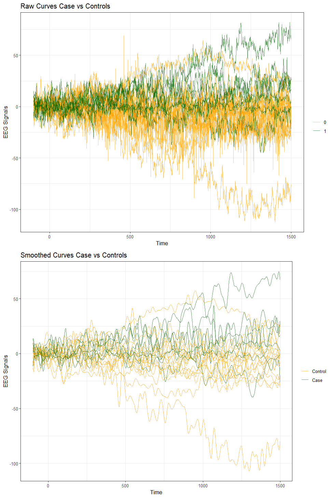
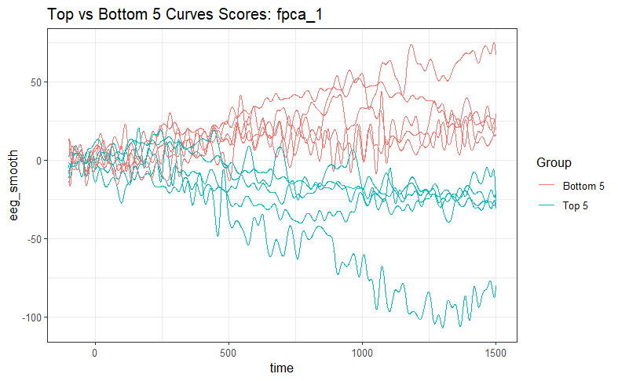
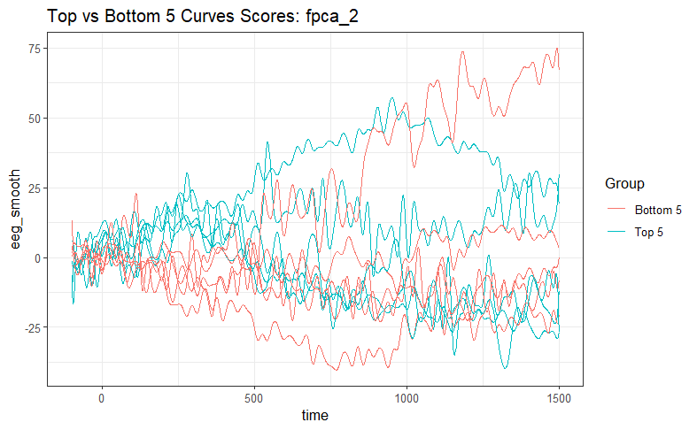
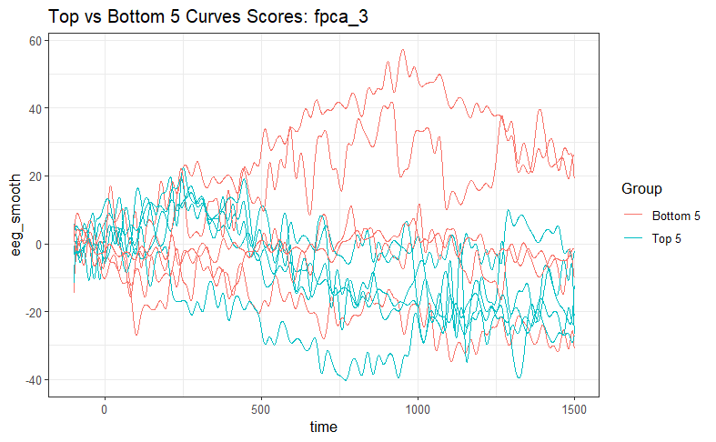
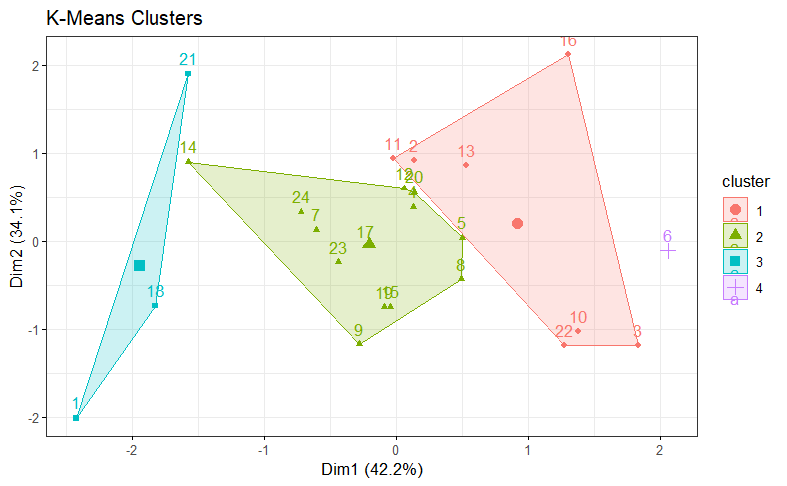
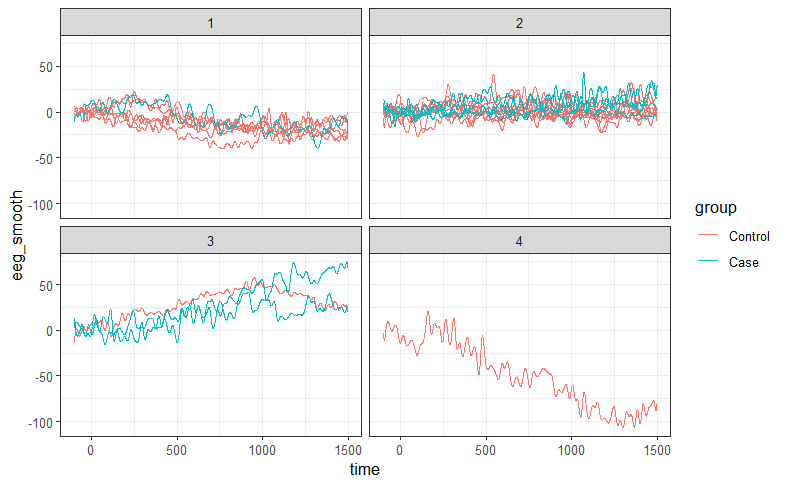

```{r, include=FALSE}
knitr::opts_chunk$set(echo = FALSE,
                      warning = FALSE,
                      tidy = FALSE,
                      message = FALSE,
                      fig.align = 'center',
                      out.width = "100%")
options(knitr.table.format = "html") 
# Load any additional libraries here
library(tidyverse)
library(plotly)
library(kableExtra)
```

# Introduction
\label{sec:intro}

An electroencephalogram (EEG) is a non-invasive test used to measure electrical activity in the brain by attaching 64 sensor nodes to the scalp. Each sensor measures a single curve, so each test produces 64 curves. The data from EEG is commonly used to diagnose conditions such as sleep disorders, seizures and schizophrenia

Schizophrenia is a mental health condition which is associated with unusual activity in the frontal and prefrontal sections of the brain.

Sensory gating is the process by which the brain filters repeated, expected or redundant stimuli. This process is impaired in individuals with schizophrenia, particularly at the P50 (indicating pre-attentive filtering of sensory information), N100 and P200 (both reflecting the attention triggering/allocation process) regions of the EEG curve, which occur 50, 100 and 200 ms after an auditory stimulus, respectively. The impairment of the sensory gating process can be detected by a difference in the amplitude of these deflections in the curve [@Shen2020; @BOUTROS2009].

Functional data analysis (FDA) is a method of statistical analysis that analyses each function as an individual sample, as opposed to considering all the points along the curve separately. It is used when the underlying curve is smooth and continuous [@RamsaySilverman2005]. EEG curves are a type of functional data that indicates the brain's electrical activity by the continuous flow of voltages over time. 

- Introduce EEG, how it relates to schizophrenia, and how FDA can be used to analyse curves
- Current Literature - FDA for EEG signals or for schizophrenia has been used before? findings? etc.

## Data

Our data were taken from the National Institute of Mental Health (NIMH project number R01MH058262), available from [Kaggle](www.kaggle.com/datasets/broach/button-tone-sz/data)

In our data, 40 subjects underwent three sensory conditions (25 controls, 15 cases) in which:

1.  Subjects press a button to immediately produce a sound
2.  Subjects passively listen to the same sound without pressing a button
3.  Subjects press a button, and no sound is produced.

Each subject completed each of these sensory conditions up to 100 times. Therefore, we have many repetitions of the same conditions for each of the subjects. So in total we have approximately $64\times 40 \times 100 = 256,000$ curves.

- Explain the study background trials, conditions etc.

# Methods
\label{sec:methods}

We used several methods: spline smoothing, permutation test, FPCA & mFPCA

## Smoothing

Due to the inherently noisy nature of EEG signals, smoothing was applied to the functional observations. When smoothing functions, it is important to balance the trade-off between variance and bias. Variance refers to the sensitivity of an estimated function to random fluctuations in the observed data, while bias refers to systematic deviation of the estimated function from the true underlying signal. High variance may lead to overfitting and poor generalisability to new data, whereas high bias may over smooth the data and obscure important signal characteristics.

Spline smoothing was used to reduce noise while preserving the underlying brain activity patterns. Specifically, 100 cubic B-spline basis functions were defined over the domain of each EEG signal, (0-1638ms). Using a relatively large number of basis functions provides sufficient flexibility to represent complex functional features while allowing smoothness to be controlled separately through penalisation.

A second-derivative roughness penalty was then applied. In penalised smoothing approaches, smoothness is controlled by incorporating a roughness penalty into the objective function used to fit the data, rather than by restricting the number of basis functions available [@RamsaySilverman2005]. Penalising the second derivative discourages rapid changes in curvature, allowing gradual variation in the fitted function while reducing excessive wiggliness. In practice, this encourages neighbouring B-spline coefficients to vary smoothly and can be viewed as approximating penalties on finite differences between adjacent coefficients. The roughness penalty pools information across neighbouring regions of the function, resulting in more stable estimates and reduced sensitivity to noise. Consequently, variance is reduced at the cost of a small increase in bias, yielding smoother and more interpretable functional representations of the EEG signals [@RamsaySilverman2005; @Gertheiss2024].

**insert plot of raw data and smoothed means

```{r, echo = FALSE, out.width="80%", fig.cap = "Plots of raw and smoothed data, coloured by case-control status", fig.pos="H"}



```


**insert formula 


## Permutation test

Permutation t-tests were used to assess differences in functional EEG trajectories between cases and controls. Permutation-based inference is well suited to functional data and has been widely applied in the FDA literature [@BugniHorowitz2021]. The test evaluates the null hypothesis that the mean functions of the two groups are equal across the domain of the EEG signal.

Under the null hypothesis, group labels are exchangeable, meaning that randomly reallocating observations between groups should not systematically alter the value of the test statistic. The permutation procedure repeatedly shuffles the case-control labels and recalculates the test statistic for each permutation, generating an empirical null distribution. The observed test statistic is then compared with this distribution to determine statistical significance. The resulting p-value represents the probability of obtaining a test statistic at least as extreme as that observed if the null hypothesis were true.

When interpreting a permutation t-test plot for an a priori, theory-driven hypothesis, statistical significance is indicated when the observed test statistic exceeds the pointwise 0.05 critical value. However, for post hoc, data-driven hypotheses, significance should be assessed relative to the maximum 0.05 critical value, which controls for multiple comparisons across the entire functional domain and provides stronger control of the family-wise error rate, (Bugni and Horowitz, 2021).

In this study, five thousand permutation t-tests were applied to the FP1 electrode on a condition-by-condition basis. FP1 region was selected due to previous evidence linking frontal EEG abnormalities, particularly gamma-band dysfunction, to schizophrenia and associated cognitive deficits [@SenkowskiGallinat2015; @JeonPolich2003; @Shin2011].


## Functional Principal Component Analysis

Following smoothing, each EEG recording was represented as a continuous function observed over 1,638 time points. Although, as mentioned above, smoothing reduces noise and improves interpretability, functional observations remain high-dimensional. As discussed by J.O Ramsay et al., this data may display a small number of dominant modes of variation - to identify and explore these, principal component analysis was applied to functional data. 

In functional PCA, eigenvalues of the bivariate variance-covariance function $\nu(s,t)$ denote the importance of each principal component. An eigenfunction is associated with each eigenvalue, and these describe major variational components. 

Due to the inherently high-dimensional nature of EEG data, directly analysing observations can be challenging. FPCA addresses this issue by representing each function as a linear combination of a small number of eigenfunctions, this allows the dominant sources of variation to be captured through a reduced set of principal component scores.  


*FPCA via PACE*

Functional Principal Component Analysis was implemented using the Principal Analysis by Conditional Estimation (PACE) method, developed by Yao et al. (2005). This pacakge is useful for the analysis of data that have been generated alongside noise or irregular time points. A key advantage of the PACE framework is that it can be used for sparsely or densely sampled random trajectories - the EEG recordings analysed in this study can be considered as densely sampled data, as each EEG curve was observed across a large number of time points on the same time grid. Here, PACE was used to estimate the principal modes of variation in the EEG curves and obtain subject-specific FPCA scores (FPCs). 

Each participant contributed a single densely sampled EEG curve corresponding to Trial 1 at the FP1 electrode under Condition 1. 

### FPCA Formula

Each EEG curve is decomposed into: (1) a mean function; (2) eigenfunctions describing major modes of variation, and; (3) subject-specific FPCA scores.

The formula is represented as follows:

$$
X_i (t) = \mu (t) + \sum _{k=1}^K \xi_{ik} \Phi_k (t)
$$
where $\xi_{ik} = \int_0^1 (X_i(t) - \mu(t))\Phi_k(t)  dt$ are the FPC scores.

Intuitively, the first 3 PC scores summarise much of the variation present across the observed EEG curves, 95%, and are used to explain the original high-dimensional functional observations. 

*Exploring FPCA scores via extreme curve and then k-means  clustering*

To help interpret the functional principal components, five subjects with the highest and lowest scores for each of the first three FCPs were chosen for visualisation. The corresponding smoothed EEG curves were then plotted to examine how variation in each score related to the change in shape of the EEG signal. This aided visual understanding of the first three FPCs.  

Following this investigation, the first three FPCA scores were then used as inputs for the k-means clustering analysis. 

As quoted from Fortuna F. "cluster analysis aims to group a set of data such that units within clusters are more similar than across clusters with respect to a metric. In the FDA context, the most popular technique is the k-means clustering algorithm" [@FortunaMaturo2019]. 

To establish an appropriate number of clusters for our k-means analysis, several values of $k$ were explored and a four-cluster solution was selected. This number was chosen as it provided a reasonable balance between cluster separation and interpretability. Given the relatively small sample size, large numbers of clusters would have resulted in very small cluster memberships. The aim of this is to investigate whether subjects with similar FPCA score patterns group together naturally. The resulting clusters were compared with schizophrenia status using a confusion matrix, and smoothed EEG curves were then plotted within each cluster. This analysis was used to assess whether FPCA scores captured patterns in the EEG data that could be relevant for differentiating between schizophrenia cases and controls. 

## Logistic Regression Model

According to Lan N. Bui, "Logistic regression is commonly utilized in clinical and educational research to examine relationships between risk factors and binary outcomes" [@BuiDing2025]. Following clustering analysis, logistic regression models were fitted to examine whether FPCA scores were associated with the classification of schizophrenia (group = 1). 

The purpose of this analysis was to assess whether the selected three FPCA scores contained significant information to discriminate between schizophrenia cases and controls. Odds ratios were also calculated to aid interpretation of the resulting fitted coefficients. 

## Multilevel Functional Principal Component Analysis

At this stage in analysis, the EEG curves of subjects within one trial and one condition were investigated. To extend this, and include several of the repeated trials per subject and conditions one could no longer use standard FPCA. 

An important limitation of standard FPCA methods is that they are not designed for multilevel analyses, due to their assumption of independence between observations. Introduced in @Di2009, multilevel FPCA was designed to address the volume and importance of EEG data specifically. This methodology is designed to extract core intra- and inter- subject components of multilevel functional data. 

*Arranging multilevel functional data*

*Multilevel FPCA model - retaining components to 95% variability explained*

- why mfpca can be applied to our data - multiple trials

$$
X_ij = \mu(t) + 
$$

*Multilevel FPC scores - describe level 1 and 2*

## Elastic Net

Elastic net is a regularization and variable selection method that combines the penalties used in ridge and lasso regression. The method is controlled by a mixing parameter, $\alpha$, where $\alpha = 0$ corresponds to ridge regression and $\alpha = 1$ corresponds to lasso regression. Values of $\alpha$ between 0 and 1 provide a balance between the two approaches, [@ZouHastie2005].

In ordinary least squares (OLS) regression, coefficients are estimated by minimizing the residual sum of squares (RSS), which represents the sum of the squared differences between the observed and predicted values. Consequently, the fitted regression line is chosen to produce predictions that are as close as possible to the observed data. Ridge regression, introduced by @HoerlKennard1970, extends OLS by adding an (L_2) penalty to the objective function. This penalty constrains the magnitude of the regression coefficients by minimizing:

$$
\mathrm{RSS} + \lambda \sum_{j=1}^{p}\beta_j^2
$$

where $\lambda$ is a non-negative tuning parameter controlling the degree of shrinkage. By shrinking coefficients towards zero, ridge regression reduces model variance and can improve predictive performance in the presence of multicollinearity. However, coefficients are not reduced exactly to zero, meaning all predictors remain in the model. Lasso regression applies an (L_1) penalty to the regression coefficients and minimizes:

$$
\mathrm{RSS} + \lambda \sum_{j=1}^{p}|\beta_j|
$$

This penalty shrinks coefficients towards zero and can set some coefficients exactly equal to zero. Consequently, lasso performs automatic variable selection, removing less informative predictors and producing a more parsimonious model, [@Tibshirani1996]. Elastic net combines the (L_1) and (L_2) penalties and minimizes:

$$
\mathrm{RSS} + \lambda \left[(1-\alpha)\sum_{j=1}^{p}\beta_j^2 + \alpha\sum_{j=1}^{p}|\beta_j|\right]
$$

This approach balances the sparsity-inducing properties of lasso with the ability of ridge regression to handle correlated predictors. The mixing parameter $\alpha$ was tuned over a grid of values between 0 and 1. For each value of $\alpha$, an elastic net model was fitted and evaluated using 10-fold cross-validation. The value of $\alpha$ that produced the lowest cross-validated error was selected, together with its corresponding optimal penalty parameter, $\lambda$. Elastic net is particularly useful when the number of predictors exceeds the number of observations and when predictors are highly correlated. In such settings, it often provides more stable and accurate predictions than lasso regression alone [@ZouHastie2005].

# Performance Evaluation

Model performance was evaluated using the Receiver Operating Characteristic (ROC) curve, the Area Under the ROC Curve (AUC), accuracy, misclassification error rate, and calibration. The ROC curve assesses the ability of a classification model to distinguish between two classes, (Fawcett, 2006), cases and controls in this application. It plots the true positive rate (sensitivity) against the false positive rate (specificity) across a range of classification thresholds. These thresholds determine the predicted probability above which an observation is classified as a case (1) rather than a control (0). The discriminatory ability of the model was quantified using the Area Under the ROC Curve (AUC), (Fawcett, 2006). The AUC can be interpreted as the probability that a randomly selected case receives a higher predicted probability than a randomly selected control. An AUC of 0.5 indicates no discriminatory ability, whereas an AUC of 1 indicates perfect discrimination. Classification performance was further evaluated using a confusion matrix. Accuracy was calculated as the proportion of correctly classified observations, while the misclassification error rate was calculated as the proportion of incorrectly classified observations. Calibration was assessed using calibration plots, which compare observed outcome frequencies with predicted probabilities, (Collins et al., 2014). A well-calibrated model produces predicted probabilities that closely reflect the observed outcomes. Perfect calibration is represented by a curve lying on the diagonal reference line, corresponding to a calibration slope of 1 and an intercept of 0.

# Results
\label{sec:results}

## Permutation t-test

The a priori null hypothesis was that, following stimulus presentation at approximately 100 ms, there would be no difference in the mean EEG functions between cases and controls. Stimulus onset is indicated by the vertical blue reference line in the plots below. As this hypothesis was pre-specified, statistical significance was assessed relative to the pointwise 0.05 critical value. Evidence against the null hypothesis is indicated when the observed test statistic exceeds this threshold.

In Condition 1, during which participants pressed a button to immediately produce a sound, the observed test statistic exceeded the pointwise 0.05 critical value over a substantial portion of the post-stimulus interval. This provides strong evidence of differences in the EEG responses of cases and controls.

INSERT PLOT

In Condition 2, during which participants passively listened to the same sound without pressing a button, the observed test statistic exceeded the pointwise 0.05 critical value over a small portion of the post-stimulus interval, suggesting evidence of differences between the groups.

INSERT PLOT

In Condition 3, during which participants pressed a button, but no sound was produced, the observed test statistic did not exceed the pointwise 0.05 critical value. Consequently, there was no evidence of a difference between the EEG responses of cases and controls.

INSERT PLOT


## Functional Principal Component Analysis

FPCA decomposes each individual curve into the mean curve plus the sum of the other principal components multiplied by a scalar (score) which indicates how much that individual curve aligns with the specific principal component.

We conducted this FPCA for a single condition and a single trial (trial 1 condition 1) since FPCA can only work on data where each person has only one curve. We chose to investigate the FPCs of condition 1 rather than the other two conditions as it showed the most significant difference in EEG signals between cases and controls according to the permutation t-test above.

```{r, echo = FALSE, out.width="80%", fig.cap = "FPCA visualisation - condition 1, trial 1", fig.pos="H"}

knitr::include_graphics("Images/FPCA.png")

```

As you can see the functional principal components are eigenfunctions which explain the main modes of variation. We found we only needed three functional principal components to explain 95% of the variability in the curves.

On the top right of this plot is the mean curve, and on the bottom right, we can see the main modes of variation about this mean curve. So, the mean curve is flattened to be a straight line, and the eigenfunctions represent the functional principal components. 

The first functional principal component, shown in black, remains close to the mean function initially, and then it drops below the mean. In the second FPC shown in red the eigenfunction rises above the mean and then dropping below. The third initially rises above the mean then goes below before rising above the mean again. 

These are the three main ways in which subject's curves vary about the mean and as we can see from the scree plot on the bottom left we can see that the first FPC explains the most variance at approximately ~90% and the second and third describe the remaining ~5% of the variation.

### Investigating FPC scores

To observe the principal component scores look like on our actual data, we have plotted the subjects with the top and bottom scores for each FPC.

```{r, echo = FALSE, out.width="80%", fig.cap="Curves with highest 5 FPC 1 scores (blue) and lowest 5 scores (red)", fig.pos="H"}



```

```{r, echo = FALSE, out.width="70%", fig.cap="Curves with highest 5 FPC 2 scores (blue) and lowest 5 scores (red)", fig.pos="H"}



```

```{r, echo = FALSE, out.width="70%", fig.cap="Curves with highest 5 FPC 3 scores (blue) and lowest 5 scores (red)", fig.pos="H"}



```


## K-means clustering 

```{r, echo = FALSE, out.width="70%", fig.cap="Visulisation of K-means clustering of FPC scores", fig.pos="H"}



```

```{r, echo=FALSE, out.width = "12%", fig.pos="H"}

knitr::include_graphics("Images/FPCA_km_cm.png")

```

```{r, echo = FALSE, out.width="70%", fig.cap="Visulisation of functions in each of the K-means clusters", fig.pos="H"}



```

- discuss FPCA components look like (top & bottom 5 scores), eigenfunctions
- discuss mfpca components - what do they look like 
- elastic net how many predictors included in final model

# Discussion
\label{sec:discussion}

## Permutation ttests

Sensory gating refers to the ability of the brain to filter repeated, expected, or redundant sensory stimuli and has been shown to be impaired in individuals with schizophrenia (Boutros et al., 2009; Shen et al., 2020). In the present study, the repeated stimulus was represented by an auditory tone. The observed differences between cases and controls in Conditions 1 and 2 are consistent with impaired sensory gating in schizophrenia.

The difference was most pronounced in Condition 1, where participants generated the sound themselves by pressing a button. In healthy controls, self-generated sensory events are typically attenuated because the sensory consequences of an action are anticipated. Consequently, the larger difference observed in this condition may reflect reduced suppression of predictable sensory input in individuals with schizophrenia.

In contrast, no evidence of group differences was observed in Condition 3, where participants pressed a button, but no sound was produced. The absence of a difference when no auditory stimulus was present provides further support for the interpretation that the findings are related to altered processing of expected auditory information rather than the differences in motor activity associated with pressing the button.


- what di the fpcs tell us and what do the scores tell us about how much an individual eeg aligns with the eigenfunction?
- what do the mfpcs tell us? at each level?
- why do they differ at level 1? why is mfpca better/worse?
- what can we conclude from elastic net - more less shrinkage? too few subjects?
- How does our model perform - calibration curve, auc, misclassification
- Anything that could further this research


## References

Bugni, F.A. and Horowitz, J.L., 2021. Permutation tests for equality of distributions of functional data. Journal of Applied Econometrics, 36(7), pp.861–877. 

Collins, G.S., de Groot, J.A.H., Dutton, S., Omar, O., Shanyinde, M., Tajar, A., Voysey, M., Wharton, R., Yu, L.M., Moons, K.G.M. and Altman, D.G. (2014) ‘External validation of multivariable prediction models: a systematic review of methodological conduct and reporting’, BMC Medical Research Methodology, 14(1), p. 40.

Fawcett, T. (2006) ‘An introduction to ROC analysis’, Pattern Recognition Letters, 27(8), pp. 861–874.

Gertheiss, J., Rügamer, D., Liew, B.X.W. and Greven, S., 2024. Functional data analysis: An introduction and recent developments. Biometrical Journal, 66(6), e202300363.

Hoerl, A.E. and Kennard, R.W. (1970) ‘Ridge Regression: Biased Estimation for Nonorthogonal Problems’, Technometrics, 12(1), pp. 55–67.

Jeon, Y.-W. and Polich, J., 2003. The P300 event-related potential in psychosis: a meta-analysis. American Journal of Psychiatry, 166(10), pp.1115–1123.

Ramsay, J.O. and Silverman, B.W., 2005. Functional Data Analysis. 2nd ed. New York: Springer. ISBN 0-387-40080-X.

Robert Tibshirani (1996) ‘Regression shrinkage and selection via the lasso’, Journal of the Royal Statistical Society: Series B (Methodological), 58(1), pp. 267–288.

Germán Aneiros-Pérez, Ricardo Cao, Juan M. Vilar-Fernández. (2011). Functional methods for time series prediction: a nonparametric approach. Journal of Forecasting. 30(4), pp.377-392. [Online]. Available at: https://doi.org/10.1002/for.1169 [Accessed 11 June 2026].

J.O Ramsay, Giles Hooker, Spencer Graves. (2009). Functional Data Analysis with R and MATLAB. NY: Springer New York.

Unknown. (2019). Principal Analysis by Conditional Estimation for Functional Data Analysis and Empirical Dynamics in Matlab.. [Online]. stat. Last Updated: 2019. Available at: https://anson.ucdavis.edu/~mueller/data/pace.html [Accessed 11 June 2026].

=======
Senkowski, D. and Gallinat, J., 2015. Dysfunctional prefrontal gamma-band oscillations reflect working memory and other cognitive deficits in schizophrenia. Biological Psychiatry, 77(12), pp.1010–1019.

Shin, Y.W., Kwon, J.S., Ha, T.H., Park, H.J., Hong, K.S., Kim, Y.Y. and Cho, H.S., 2011. Gamma oscillation in schizophrenia. Psychiatry Investigation, 8(4), pp.288–296.
b720f887b39546aca4786026cf2d25f5312bc228

Fortuna, F., Maturo, F. K-means clustering of item characteristic curves and item information curves via functional principal component analysis. Qual Quant 53, 2291–2304 (2019). https://doi.org/10.1007/s11135-018-0724-7

Lan N. Bui, Qian Ding,
Logistic regression modeling: methodological insights and roadmap, Currents in Pharmacy Teaching and Learning, Volume 17, Issue 12, 2025, 102460, ISSN 1877-1297, https://doi.org/10.1016/j.cptl.2025.102460.

Di CZ, Crainiceanu CM, Caffo BS, Punjabi NM. MULTILEVEL FUNCTIONAL PRINCIPAL COMPONENT ANALYSIS. Ann Appl Stat. 2009 Mar 1;3(1):458-488. doi: 10.1214/08-AOAS206SUPP. PMID: 20221415; PMCID: PMC2835171.

Zou, H. and Hastie, T. (2005) ‘Regularization and variable selection via the elastic net’, Journal of the Royal Statistical Society: Series B (Statistical Methodology), 67(2), pp. 301–320.

